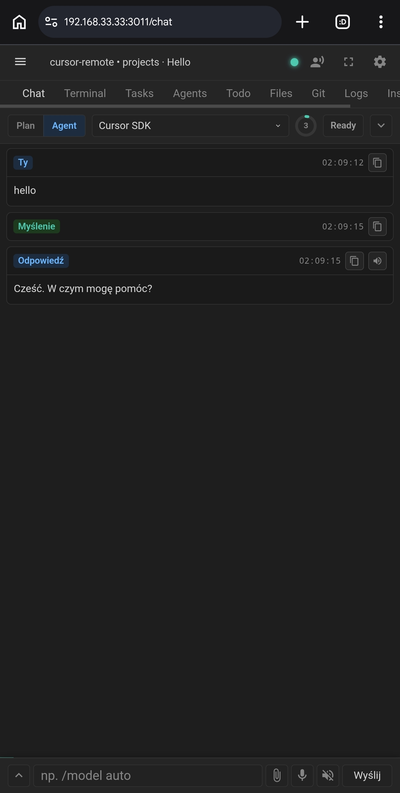
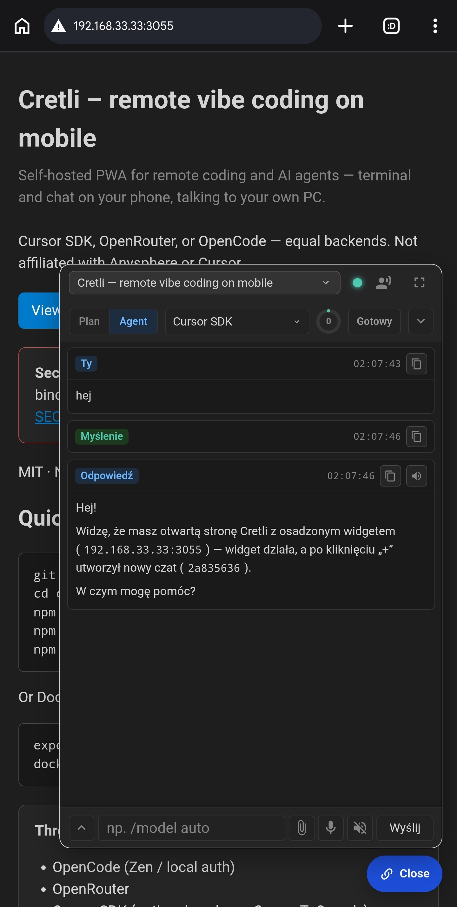

# Cretli – Remote Vibe Coding on Mobile

Official website: [cretli.com](https://cretli.com)

[](https://github.com/cretli/cretli/actions/workflows/ci.yml)
[](LICENSE)
[](https://nodejs.org)

**Cretli** is an open-source **self-hosted** PWA for **remote coding** and **vibe coding**
with **AI agents**. Use it from your phone: terminal, prompts, diffs, and interactive
widgets — talking to your own PC over HTTPS.

Backends: **OpenCode**, **OpenRouter**, **Cursor SDK**, **CodeBuddy**, **DeepSeek**,
**Qwen Code**, and **Codex**. Multiple devices can share the same session live.

> **Status:** early/experimental (`v0.4.0`). The server exposes a full shell — read
> [SECURITY.md](SECURITY.md) before putting it on a network.
>
> Cretli is **not affiliated with** Anysphere or Cursor. “Cursor” is a trademark of
> its respective owners. See [NOTICE](NOTICE).

<table>
  <tr>
    <td align="center" valign="top" width="50%">
      
      <br />
      <strong>Mobile app</strong> — the full PWA on a phone: chat, terminal, tasks, files, git. Same live session as the desktop.
    </td>
    <td align="center" valign="top" width="50%">
      
      <br />
      <strong>Widget</strong> — the same agent chat embedded on a project page (here the Cretli landing). Page context + any chat harness.
    </td>
  </tr>
</table>

## Features / use cases

### True mobile vibe coding

Code and steer agents on the go without sitting at a desk. Install the PWA on
your phone; the live terminal and chat stay on your PC.

### Remote Cursor and agent control

Trigger prompts, review tool calls and diffs, and manage sessions over a
lightweight web UI — seven pluggable harnesses on one WebSocket protocol.

### OpenRouter integration

Bring your own API keys for Claude, GPT, or open-source models. OpenCode, Qwen Code,
Codex, DeepSeek, CodeBuddy, and Cursor SDK are first-class alternatives.

### Self-hosted developer tools

No cloud workspace. The server runs on your machine. Default bind is localhost;
LAN is opt-in. Read [SECURITY.md](SECURITY.md) before exposing it.

## How it works

- Workspaces are **self-config first**: a workspace is its own list of folders in
  Cretli settings — no Cursor file required. Folder enable/disable, names and the
  default folder save immediately. Folder order in the list is the workspace order:
  the first folder is the root (Cursor rules, skills, and agents). A `.code-workspace` file (Cursor/VS Code) is an
  optional **import/link**: sync re-reads it on demand, you can convert a file
  workspace into a plain Cretli workspace (stop syncing), and you can export any
  workspace's folders to a new `.code-workspace` file. Paths can be typed or picked
  with the built-in folder/file browser (`Browse` next to each path field); the
  browser can also create a new folder.
- **Terminal** — a PTY (`node-pty`) running your shell in the workspace CWD, rendered
  with xterm.js. One PTY per session; output is broadcast to every connected client.
- **Chat** — an agent in the same workspace, rendered as a rich HTML view (tool calls,
  markdown, plan/agent mode). Choose one harness per chat:
  - **OpenCode** — local `opencode serve` + Zen (or Z.AI)
  - **OpenRouter** — OpenRouter API + server-side workspace tools
  - **Cursor SDK** — optional `@cursor/sdk` (Cursor API key + Cursor ToS)
  - **CodeBuddy** — optional `@tencent-ai/agent-sdk` plus the `codebuddy` CLI
  - **DeepSeek Harness** — optional `@deepseek-ai/dsh-sdk-client` plus `@deepseek-ai/dsh`
  - **Qwen Code** — optional `@qwen-code/sdk` plus a [Qwen Cloud](https://home.qwencloud.com) API key
  - **Codex SDK** — optional `@openai/codex-sdk` plus the bundled Codex CLI
- **Tasks / Files / Git / Todo** — VS Code tasks, workspace tree, git actions, lightweight todos.
- Same live view on every device: the in-app link/QR points at the LAN URL.

## Requirements

- Node.js 22.13+ (see `engines` in `package.json`)
- Chat needs **one** backend (see [Chat backends](#chat-backends) below). Terminal and
  files work with no API keys.

## Quick start

```bash
git clone https://github.com/cretli/cretli.git
cd cretli
npm install
npm run build:front:prod   # build the SPA into public/dist
npm start                  # binds 127.0.0.1, HTTPS
```

Open **https://localhost:3011**. On first run you will be redirected to **`/login`** to
set the access password.

Without HTTPS: `USE_HTTPS=0 npm start` → `http://localhost:3011`.

Docker (host port published to localhost only):

```bash
export CRETLI_SETUP_TOKEN="$(openssl rand -hex 16)"
docker compose up --build
# then open https://localhost:3011 and paste CRETLI_SETUP_TOKEN on first-run setup
```

See [docs/INSTALL.md](docs/INSTALL.md) for Linux, macOS, WSL2, Termux (server on the phone), and LAN/HTTPS.

## Chat backends

Configure at least one path. Settings → Harness shows which backends are ready.

### A. OpenCode

1. Install the [OpenCode CLI](https://opencode.ai/) (or rely on the optional `opencode-ai` npm package).
2. Set `OPENCODE_API_KEY` (Zen) or run `opencode auth login` on the host — also available in Settings.
3. Create a chat with harness **OpenCode**. First run may take 1–2 minutes while `opencode serve` starts.

Details: [docs/opencode/SETUP.md](docs/opencode/SETUP.md).

### B. OpenRouter

1. Set `OPENROUTER_API_KEY` (or paste it in Settings → Harness).
2. Create a chat with harness **OpenRouter**.

### C. Cursor SDK (optional)

1. `npm install` already tries to install optional `@cursor/sdk`. If you skipped optional
   deps: `npm install @cursor/sdk`.
2. Set `CURSOR_API_KEY` (or Settings). Cursor CLI is needed for scheduled `.cursor/agents` runs.
3. Create a chat with harness **Cursor SDK**.

Using Cursor API/CLI is subject to [Cursor Terms of Service](https://cursor.com). MIT here
covers only Cretli source code.

### D. CodeBuddy (optional)

1. Install the [CodeBuddy CLI](https://www.codebuddy.ai/docs/cli/sdk) and optional `@tencent-ai/agent-sdk`.
2. Set `CODEBUDDY_API_KEY` (or Settings → Harness → CodeBuddy).
3. Create a chat with harness **CodeBuddy**.

Details: [docs/codebuddy/SETUP.md](docs/codebuddy/SETUP.md).

### E. DeepSeek Harness (optional)

1. `npm install` tries to install optional `@deepseek-ai/dsh-sdk-client` and `@deepseek-ai/dsh` (pinned to `0.1.2-alpha.5`).
2. Set `DEEPSEEK_API_KEY` (or Settings → Harness → DeepSeek).
3. Create a chat with harness **DeepSeek**.

Details: [docs/deepseek/SETUP.md](docs/deepseek/SETUP.md).

### F. Qwen Code (optional)

1. `npm install` tries to install optional `@qwen-code/sdk` (`^0.1.8`; CLI is bundled).
2. Create an API key at [home.qwencloud.com](https://home.qwencloud.com) (API Keys). Set `QWEN_API_KEY` or paste it in Settings → Harness → Qwen.
3. Pick the matching plan preset (pay-as-you-go / Token Plan / Coding Plan). The key and Base URL must match or the API returns 401.
4. Create a chat with harness **Qwen**.

Details: [docs/qwen/SETUP.md](docs/qwen/SETUP.md).

### G. Codex SDK (optional)

1. `npm install` tries to install optional `@openai/codex-sdk` (pulls `@openai/codex` and the platform binary).
2. Sign in with ChatGPT (Go / Plus / Pro) in Settings → Harness → Codex, **or** set `CODEX_API_KEY`.
3. Create a chat with harness **Codex**.

Details: [docs/codex/SETUP.md](docs/codex/SETUP.md).

## Authentication & network exposure

- Default bind is **127.0.0.1** (localhost only). LAN is opt-in:
  `npm run start:lan` or `CRETLI_BIND=0.0.0.0`.
- Binding beyond localhost **without a password** requires `CRETLI_SETUP_TOKEN` or the
  process refuses to start (no first-run race on LAN).
- **Do not expose this directly to the Internet.** Use a VPN or SSH tunnel.

## Install as an app (PWA)

The app ships a web manifest and a service worker. Add to Home Screen on a phone
(or install in desktop Chromium). Live data (terminal/chat) always goes to the running server.

## HTTPS (microphone from a phone)

```bash
npm run gen-cert
# or set SSL_IP to your LAN address, then: node scripts/generate-ssl-cert.js
npm start
```

On the phone open `https://<lan-ip>:3011` and accept the self-signed cert warning.

## Configuration

All variables are optional. Copy [.env.example](.env.example) to `.env` — `npm start`
loads it automatically (Node's native `--env-file`). Highlights:

| Variable | Default | Purpose |
|----------|---------|---------|
| `PORT` | `3011` | HTTP/WS port |
| `CRETLI_BIND` | `127.0.0.1` | Bind host (`0.0.0.0` for LAN) |
| `CRETLI_SETUP_TOKEN` | — | Required for first-run setup when bound beyond localhost |
| `USE_HTTPS` | `1` (via `npm start`) | HTTPS with `data/key.pem`+`cert.pem` |
| `WORKSPACE_FILE` | `cretli.code-workspace` if present | Optional default `.code-workspace` (you can also add folders in Settings) |
| `WORKSPACES_SCAN_DIR` | parent of the current workspace | Seed/sync scan root for `*.code-workspace` files |
| `CRETLI_DATA_DIR` | `data` | Where chats, settings, auth and certs are stored |
| `CRETLI_LAN_HOST` | auto | Host used in the in-app link/QR |
| `OPENCODE_API_KEY` | — | OpenCode Zen key |
| `OPENROUTER_API_KEY` | — | OpenRouter chat |
| `CURSOR_API_KEY` | — | Cursor SDK chat |
| `CODEBUDDY_API_KEY` | — | CodeBuddy chat |
| `DEEPSEEK_API_KEY` | — | DeepSeek Harness chat |
| `QWEN_API_KEY` | — | Qwen Code chat (Qwen Cloud). Alias: `DASHSCOPE_API_KEY` |
| `QWEN_ENDPOINT` | `payg` | Qwen Cloud plan: `payg` / `token-plan` / `coding-plan` / `custom` |
| `CODEX_API_KEY` | — | Codex SDK chat (or ChatGPT sign-in in Settings) |
| `AGENT_CALLBACK_TOKEN` | — | Required for agent callbacks when exposed on LAN |

Legacy `CURSOR_REMOTE_*` aliases still work. Documented names are `CRETLI_*`.

Runtime data lives in `data/` (gitignored).

## Comparison

| | Cretli | OpenCode TUI | code-server | Open WebUI |
|--|--------|--------------|-------------|------------|
| Phone PWA + shared live session | yes | no | IDE in browser | chatbot UI |
| Full PTY terminal | yes | TUI only | yes | no |
| Pluggable agent backends | 7 harnesses | OpenCode | extensions | models |
| Self-hosted on your PC | yes | yes | yes | yes |

## Architecture (brief)

- **HTTP** — `public/`, REST API (workspace, chats, settings, files, git, todos).
- **WebSocket** — `/ws` (terminal), `/ws-agent-sdk` (chat rooms for all harnesses).
- **Backend** — Node.js, Express, `node-pty`, `ws`, optional Cursor / Qwen / Codex / DeepSeek / CodeBuddy SDKs.
- **Frontend** — SPA in `app_front/` (webpack → `public/dist/`).

[docs/ARCHITECTURE.md](docs/ARCHITECTURE.md) · [docs/MULTI-INSTANCE.md](docs/MULTI-INSTANCE.md)

## Contributing

PRs and issues are welcome. See [CONTRIBUTING.md](CONTRIBUTING.md) and the
[Code of Conduct](CODE_OF_CONDUCT.md). Run `npm test` before opening a PR.
Suggested starter tasks are listed in CONTRIBUTING.

## License

[MIT](LICENSE) — see [NOTICE](NOTICE) for third-party terms (`@cursor/sdk` is proprietary
and optional).
