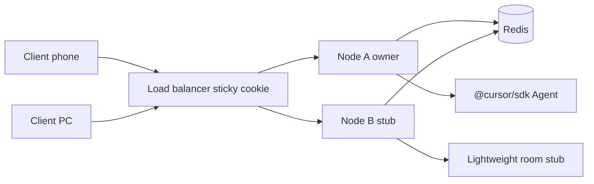

# Multi-instance deployment (SDK chat)

Cretli can run **2+ Node.js processes** behind a reverse proxy when Redis and sticky routing are configured.

## Requirements

| Component | Purpose |
|-----------|---------|
| **Redis** (`CRETLI_REDIS_URL` or legacy `CURSOR_REMOTE_REDIS_URL`) | Pub-sub for live SDK events + room owner registry |
| **Sticky sessions** | Route the same browser to the same Node instance (Agent runs in-process) |
| **Shared `data/`** | Same `chats.json`, chat history, config (NFS/sync or single writer) |

Optional:

- `CRETLI_INSTANCE_ID` / `CURSOR_REMOTE_INSTANCE_ID` — stable id per Node process (otherwise random UUID at start)
- `CRETLI_SDK_ROOM_OWNER_TTL_SEC` / `CURSOR_REMOTE_SDK_ROOM_OWNER_TTL_SEC` — owner lease TTL (default **120** s)

## Architecture



- **Owner instance** (registry entry): runs `@cursor/sdk` Agent, writes history, publishes WS events to Redis.
- **Non-owner instance**: creates a **remote stub** room — clients receive live events via Redis, read-only for prompts until owner lease expires.
- **Failover**: when owner TTL expires (crash / scale-in), another instance can **claim** the room on the next prompt (`Agent.resume` from persisted `sdkAgentId`).

## Sticky session cookie

Each HTTP response sets `cretli-instance=<serverInstanceId>` (legacy alias `cursor-remote-instance`) when absent (`lib/sdk/sdk-sticky-session.js`).

Use the cookie in your load balancer so WebSocket upgrades hit the same backend.

### nginx example (hash on cookie)

nginx maps cookie names to variables by replacing `-` with `_`, so
`cretli-instance` is read as `$cookie_cretli_instance`.

```nginx
upstream cretli {
  hash $cookie_cretli_instance consistent;
  server 127.0.0.1:3011;
  server 127.0.0.1:3012;
}

server {
  listen 443 ssl;
  location / {
    proxy_pass http://cretli;
    proxy_http_version 1.1;
    proxy_set_header Upgrade $http_upgrade;
    proxy_set_header Connection "upgrade";
    proxy_set_header Host $host;
    proxy_read_timeout 3600s;
  }
}
```

Alternative: nginx `sticky` module, Traefik sticky cookie, HAProxy `balance source` (less precise for NAT).

## Environment

```bash
# Instance A
CRETLI_INSTANCE_ID=cretli-node-a
CRETLI_REDIS_URL=redis://127.0.0.1:6379
PORT=3011

# Instance B
CRETLI_INSTANCE_ID=cretli-node-b
CRETLI_REDIS_URL=redis://127.0.0.1:6379
PORT=3012
```

## Health checks

`GET /api/health` returns:

```json
{
  "ok": true,
  "serverInstanceToken": "...",
  "serverInstanceId": "cr-node-a",
  "sdkRoomBus": "redis",
  "sdkRoomRegistry": "redis"
}
```

Configure the load balancer to probe `/api/health` and drain unhealthy backends.

After an owner dies:

1. Registry key expires (~120 s default).
2. Clients on a stub see `remote_room_stub` if they try to send while another owner is registered.
3. After TTL, the next prompt on any instance upgrades the stub and registers as owner.

Cross-device **history sync** (HTTP revision poll) still works without sticky — only **live run + send** require owner routing.

## WS protocol notes

`hello` may include:

- `remoteStub: true`
- `ownerInstanceId: "<uuid>"`

Error code when sending on a stub while another instance owns the run:

- `code: "remote_room_stub"`

## Limitations

- In-flight run state is lost when the owner process dies (history on disk remains).
- Event log WS replay cap (1200) still applies; use HTTP history pull for long gaps.
- Terminal/agent PTY sessions are **not** multi-instance — only SDK chat rooms use Redis.
